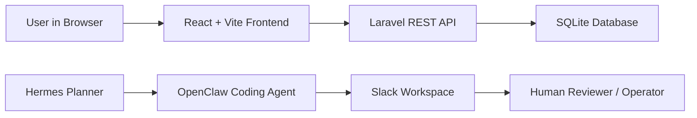

# Architecture

## Goal

Ship the smallest working Forge 2 qualifier application: a Kanban board with boards, lists, cards, edit fields, due dates, and card movement.

## System Shape

## Components

- Frontend: React + Vite, deployed on Vercel.
- Backend: Laravel REST API, deployed on Render.
- Database: SQLite, created and migrated by the backend start command.
- Planner: Hermes is treated as the planning layer that sets task order and scope.
- Coding agent: OpenClaw is treated as the coding agent connected to Slack.
- Human operator: Aryan reviews status, deploys, and makes final calls.

## Slack Channels

Observed Forge2 Aryan workspace channels:

- `#agent-coder`
- `#agent-log`
- `#all-forge2-aryan`
- `#new-channel`
- `#social`
- `#sprint-main`

Recommended usage:

- `#agent-coder`: coding requests and agent execution updates.
- `#agent-log`: durable logs, summaries, and links to outputs.
- `#sprint-main`: deadline checklist and final submission coordination.
- `#all-forge2-aryan`: broad announcements.

## Data Model

- `boards`
  - `id`
  - `title`
  - `slug`
  - timestamps
- `lists`
  - `id`
  - `board_id`
  - `title`
  - `position`
  - timestamps
- `cards`
  - `id`
  - `list_id`
  - `title`
  - `description`
  - `due_date`
  - `position`
  - timestamps

## API Behavior

`GET /api/boards/default` creates the default Forge 2 board and the Todo, Doing, Done lists if they do not exist. This keeps first-run setup simple for evaluation.

Card movement is handled with `POST /api/cards/{card}/move` and a `list_id` payload. Drag and drop was intentionally skipped to reduce risk near the deadline.

## Deployment

Render runs the Laravel backend from `backend/Dockerfile`. Vercel builds the frontend from `frontend/` and injects `VITE_API_BASE_URL` so the browser talks to Render.
